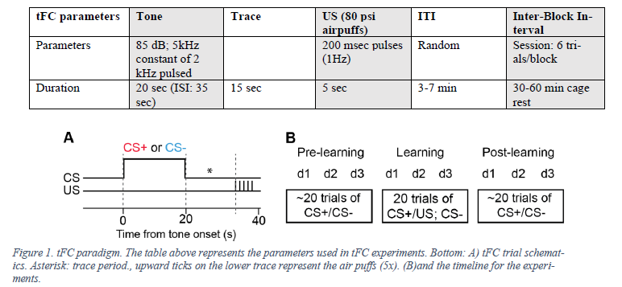

# Arduino sketch for performing trace-fear conditioning.

Graphical representtion of the trace-fear conditioning protocol:

### The arduino controlls the following components:
* 2 speakers which play two different tones (`CS+` and `CS-`)
* one water solenoid valve which delivers a water drop throughout the trial
* one air solenoid valve which delivers a series (5x) of airpuffs at the end of `CS+` the trial 
* Lickport which delivers a water drop when the mouse licks it

### The arduino records the following events:
* times the mouse lickes the lickometer

The trials make up blocks. 
One block consists of 3 trials of `CS+` and 3 trials of `CS-` in random order.